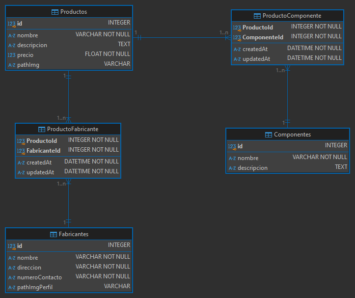

# Nodejs Sequelize REST API

- nodejs
- express
- sequelize
- sqlite

## Requisitos

- Node.js
- sqlite

## Instalacion

1. Clonar Repositorio : `git clone https://github.com/EP-2024C2/tp-ntom-fsociety404.git`

2. Instalar dependencias : `npm install`

3. Crear un archivo `config.json` en la carpeta raiz del proyecto con la configuracion de la BD:
```json
{
  "development": {
    "dialect": "sqlite",
    "storage": "./data/db.sqlite"
},
  "test": {
    "username": "un_usuario",
    "password": "una_contraseña",
    "database": "nombre_bd",
    "host": "127.0.0.1",
    "dialect": "mysql"
  },
  "production": {
    "database": "edp",
    "username": "usuario",
    "password": "contraseña",
    "host": "127.0.0.1",
    "dialect": "postgres"
  }
}
```
o copie el archivo `config-ejemplo.json` a `config.json` y realice las modifcaciones con los datos de conexión 

4. Ejecutar servidor: `npm start`


### Entorno de Desarrollo
### prerequisitos
* docker
* docker compose

#### con instancia de BD de prueba `mysql`:
1. crear archivo `.env`
2. agregar la linea `COMPOSE_FILE=docker-compose-mysql.yml`
3. configurar datos de conexión en `config.json`
3. iniciar instancia de bd: `docker compose up -d`
4. iniciar servidor en modo desarrollo: `npm run dev`
 
#### con instancia de BD de prueba `postgres`:
1. crear archivo `.env`
2. agregar la linea `COMPOSE_FILE=docker-compose-psql.yml`
3. configurar datos de conexión en `config.json`
3. iniciar instancia de bd: `docker compose up -d`
4. iniciar servidor en modo desarrollo: `npm run dev`


## Endpoints

| Verbo  | Recurso                    | Status code   | Descripción                                           |
| ------ | -------------------------- | ------------- | ----------------------------------------------------- |
| GET    | /productos                 | 200           | Obtener todos los productos                           |
| GET    | /productos/:id             | 200, 404      | Obtener un producto en particular                     |
| POST   | /productos                 | 201, 400      | Crear un producto                                     |
| PUT    | /productos/:id             | 200, 404      | Modificar los datos de un producto en particular      |
| DELETE | /productos/:id             | 200, 404, 500 | Borrar un producto en particular                      |
| POST   | /productos/:id/fabricantes | 201, 404, 400 | Crear la asociación de producto con 1 o N fabricantes |
| GET    | /productos/:id/fabricantes | 200, 404      | Obtener todos los fabricantes de un producto          |
| POST   | /productos/:id/componentes | 201, 404, 400 | Crear la asociación de producto con 1 o N componentes |
| GET    | /productos/:id/componentes | 200, 404      | Obtener todos los componentes de un producto          |
| GET    | /fabricantes               | 200           | Obtener todos los fabricantes                         |
| GET    | /fabricantes/:id           | 200, 404      | Obtener un fabricante en particular                   |
| POST   | /fabricantes               | 201, 400      | Crear un fabricante                                   |
| PUT    | /fabricantes/:id           | 200, 404      | Modificar los datos de un fabricante en particular    |
| DELETE | /fabricantes/:id           | 200, 404, 500 | Borrar un fabricante en particular                    |
| GET    | /fabricantes/:id/productos | 200, 404      | Obtener todos los productos de un fabricante          |
| GET    | /componentes               | 200           | Obtener todos los componentes                         |
| GET    | /componentes/:id           | 200, 404      | Obtener un componente en particular                   |
| POST   | /componentes               | 201, 400      | Crear un componente                                   |
| PUT    | /componentes/:id           | 200, 404      | Modificar los datos de un componente en particular    |
| DELETE | /componentes/:id           | 200, 404, 500 | Borrar un componente en particular                    |
| GET    | /componentes/:id/productos | 200, 404      | Obtener todos los productos de un componente          |

## Modelo de API



## Estructura del Proyecto

```bash
.
├── DER.png                             #    
├── README.md                           # este archivo
├── config-ejemplo.json                 # configuración de bd de ejemplo
├── config.json                         # configuración de bd
├── data                                # carpeta de datos
│   └── db.sqlite
├── db.sqlite.png
├── docker-compose-mysql.yml            # configuración docker para bd mysql
├── docker-compose-psql.yml             # configuración docker para bd postgres
├── package-lock.json
├── package.json
└── src
    ├── app.js                          # punto de ingreso a la aplicación 
    ├── config                          # modulo para carga de confriguración
    │   └── index.js                    
    ├── controllers                     # controladores
    │   ├── componente_controllers.js
    │   ├── fabricante_controllers.js
    │   ├── index.js
    │   └── producto_controllers.js
    ├── middlewares
    │   └── middleware.js
    ├── migrations
    │   ├── 20241006193906-create-fabricante.js
    │   ├── 20241006194138-create-componente.js
    │   └── 20241006194256-create-producto.js
    ├── models                          # modelos
    │   ├── componente_model.js
    │   ├── fabricante_model.js
    │   ├── index.js
    │   └── producto_model.js
    ├── routes                          # rutas
    │   ├── componente_routes.js
    │   ├── fabricante_routes.js
    │   ├── index.js
    │   └── producto_routes.js
    └── schemas                         # esquemas de validación
        ├── componente_schemas.js
        ├── fabricante_schemas.js
        ├── producto_schemas.js
        └── schemas_comunes.js
```
 
